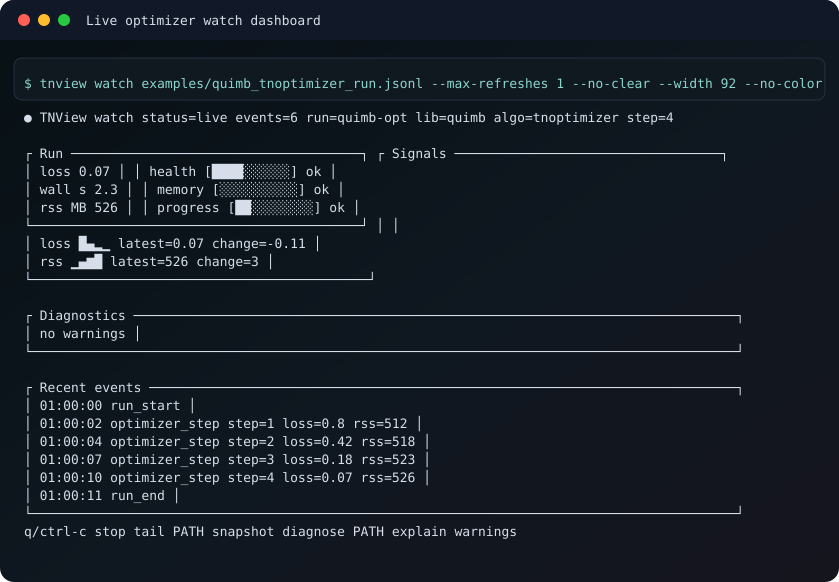

# TNView

TNView records, replays, and diagnoses tensor-network runs from append-only
telemetry, with adapters for Quimb-style workflows.

It is a terminal-first tool for long-running DMRG, TEBD, and tensor-network
optimization jobs. A run emits JSONL through `RunLogger` or an adapter; TNView
can then watch the file over SSH, tail the latest state, replay events, run
deterministic heuristic diagnostics, and compare variants without a browser
dashboard.

```text
RunLogger -> tnview watch -> tnview diagnose -> tnview compare
```



## Current Status

| Area | Status |
| --- | --- |
| Core telemetry | `RunLogger`, run-log JSONL schema `0.1`, strict/non-strict logging behavior, validation, tail, watch, replay, diagnose, and compare are implemented. |
| Reliability pass | Non-strict logging failures are observable; follow/watch reads are incremental; partial final JSONL records, truncation, and rotation behavior are tested. |
| Upstream substrate | Quimb and TeNPy commits are pinned in [UPSTREAM.md](UPSTREAM.md). They are optional integrations, not required dependencies. |
| E001 | Preregistered in [experiments/e001/experiment.md](experiments/e001/experiment.md). Canonical Quimb diagnostic-validation evidence has not been run yet. |
| Local smoke | `./scripts/reproduce_e001.sh smoke` validates fixture logs, runs current diagnostics/compare commands, and records smoke-only logger overhead under ignored `.artifacts/`. |
| Canonical run | `./scripts/reproduce_e001.sh canonical --dry-run` prints the preregistered corpus size. Full execution is blocked until the Quimb corpus runner and paired-reference artifact writer exist. |

## Question

Can telemetry from the early portion of a DMRG or TEBD run identify
capacity-limited or truncation-limited runs early enough to avoid wasted compute
while keeping false stops on healthy runs low?

## Method

The planned E001 comparison evaluates:

- no early warning;
- the current fixed TNView diagnostic thresholds;
- a recent-trend baseline using only the last few telemetry points;
- an oracle label derived from the completed paired higher-accuracy run;
- a declared early diagnostic policy using only metrics available by a fixed
  early fraction of the run.

Until E001 is run, TNView diagnostics should be read as deterministic
operator-guidance heuristics, not a validated scientific classifier.

## Install

From this repository:

```bash
make setup
source .venv/bin/activate
```

Or install into an active environment:

```bash
python -m pip install -e .
python -m pip install -e ".[quimb]"   # optional
python -m pip install -e ".[tenpy]"   # optional
```

## Reproduce

Run local acceptance checks:

```bash
make check
make runlog-demo
```

Run the E001 smoke path:

```bash
./scripts/reproduce_e001.sh smoke
```

Inspect the canonical plan:

```bash
./scripts/reproduce_e001.sh canonical --dry-run
```

Run the optional Quimb demo only in an environment with Quimb installed:

```bash
make quimb-demo
```

## Record a Run

```python
from tnview import RunLogger

with RunLogger("runs/dmrg.jsonl", run_id="dmrg-001") as log:
    log.start(library="my-code", algorithm="dmrg", model="ising", sites=128)
    for sweep in range(4):
        log.dmrg_sweep(
            sweep=sweep,
            library="my-code",
            energy=-1.0 - sweep * 0.01,
            delta_energy=1e-9,
            max_chi=128,
            chi_max=128,
            max_trunc_err=2e-7,
        )
    log.end(status="complete")
```

Inspect it:

```bash
tnview watch runs/dmrg.jsonl
tnview tail runs/dmrg.jsonl
tnview diagnose runs/dmrg.jsonl
```

## Demo Assets

Public fixture screenshots are checked in under:

- [docs/demo/demo-instrument.svg](docs/demo/demo-instrument.svg)
- [docs/demo/watch-dashboard.svg](docs/demo/watch-dashboard.svg)
- [docs/demo/diagnostics.svg](docs/demo/diagnostics.svg)
- [docs/demo/compare-runs.svg](docs/demo/compare-runs.svg)

They are generated CLI examples and should not be treated as validation
evidence.

## Implementation Map

| Path | Purpose |
| --- | --- |
| `tnview/logger.py` | Append-only run-log writer and non-strict failure observability. |
| `tnview/runlog.py` | JSONL parsing, schema compatibility, and incremental follow support. |
| `tnview/cli.py` | Terminal commands: watch, tail, validate, diagnose, compare, replay, schema, and demos. |
| `tnview/diagnose.py` | Deterministic diagnostic rules and thresholds. |
| `tnview/adapters/quimb.py` | Optional Quimb-style MPS and optimizer telemetry adapters. |
| `tnview/adapters/tenpy.py` | Optional TeNPy-style observer helpers. |
| `experiments/e001/` | Preregistered diagnostic-validation experiment and smoke/canonical configs. |
| `docs/telemetry.md` | Current schema, legacy replay compatibility, and migration notes. |

## Evidence Boundary

Current checked-in examples and demo assets show CLI behavior on fixture logs.
They are not a labeled validation corpus for early stopping.

E001 has not produced canonical Quimb results yet. Promotion of diagnostic
claims requires paired higher-accuracy references, held-out controls, a
confusion matrix, compute-saved analysis, false-stop accounting, and parser /
logger overhead measurements from the canonical corpus.

## Limitations

See [docs/limitations.md](docs/limitations.md). In short:

- diagnostics are deterministic heuristics until E001 validates them;
- Quimb and TeNPy are optional and not required for the core package;
- fixture logs and demo SVGs are CLI examples, not corpus evidence;
- logger-overhead output from the smoke script is environment-specific and not
  a canonical benchmark;
- TNView records telemetry summaries, not full tensor-network state.

## License

MIT. See [LICENSE](LICENSE).
